# kusal

**Reach your dev machine — its shell and its AI coding agents — from any browser or your phone, over a Cloudflare Tunnel that only your own Cloudflare Zero Trust account can open.**

Run `kusal connect` on a machine. It authenticates with Cloudflare, brings up a private tunnel, and serves a web UI that gives you that machine's projects, agent threads, and a real terminal. Open it from a laptop, a tablet, or the Android app. Nothing is exposed publicly — every request goes through your Cloudflare Access policy first.

The agents are the CLIs you already have installed and signed in on that machine. kusal launches them locally under your own login and relays the transcript. It never handles a provider credential, never calls a model API itself, and never resells access.

## Screenshots

### Web

| Threads + chat | Project picker (`⌘K`) |
|---|---|
| 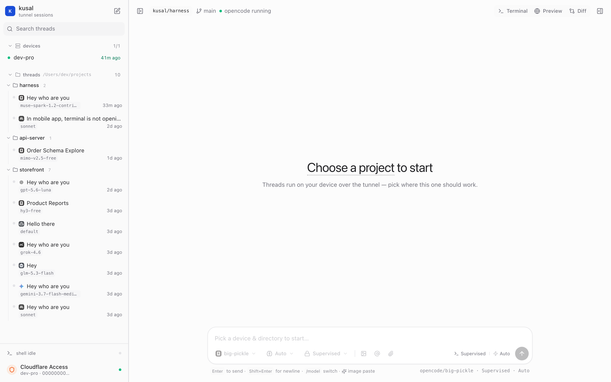 | 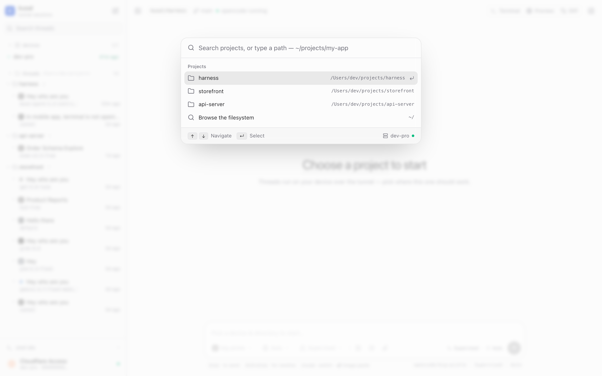 |
| **Thread timeline** | **Terminal drawer** |
| 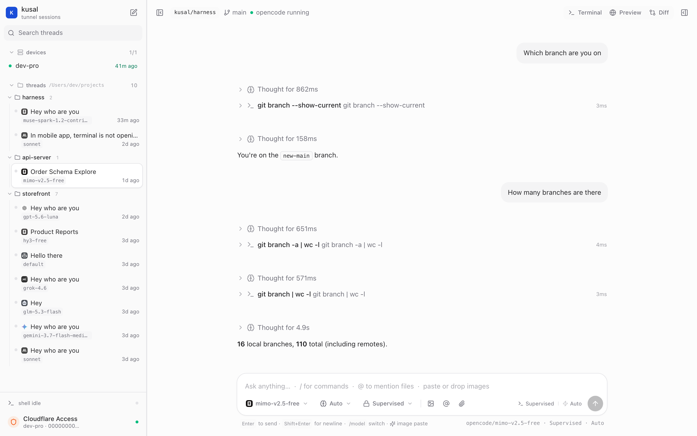 | 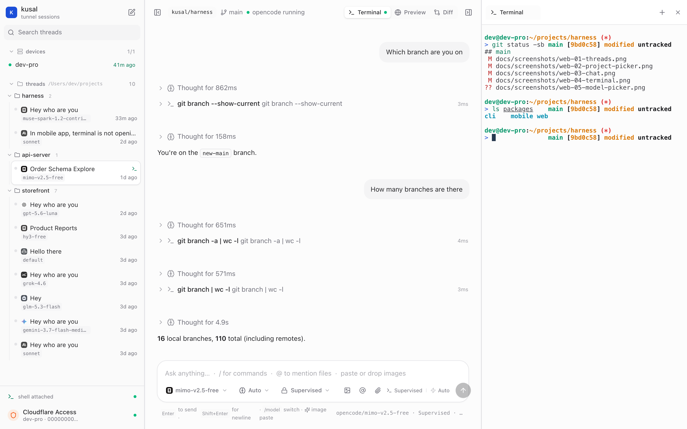 |
| **Model picker (`/model`)** | |
| 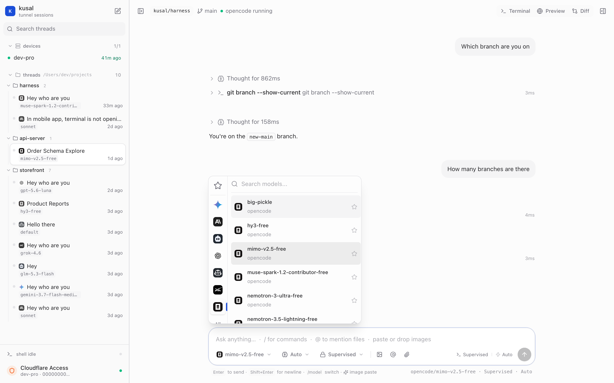 | |

### Mobile

| Devices | Projects | Threads |
|---|---|---|
| 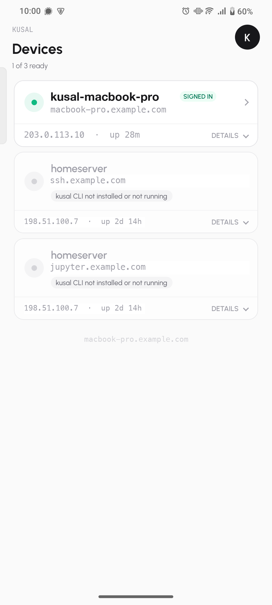 | 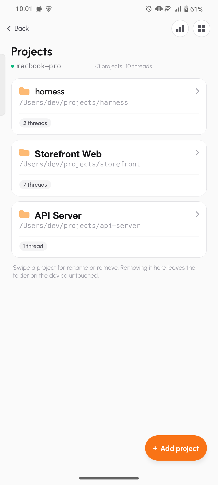 | 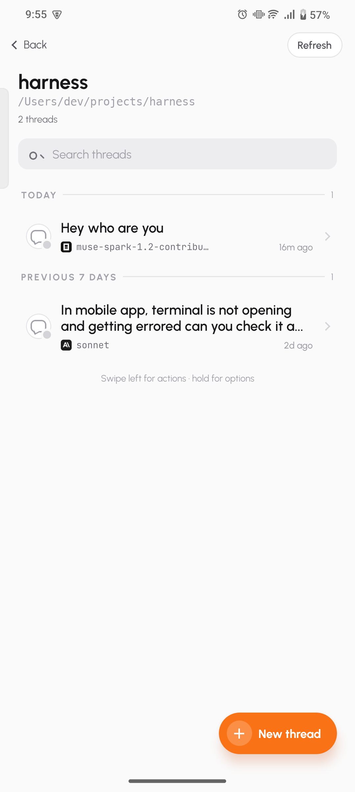 |
| **Chat** | **Terminal** | **Usage** |
| 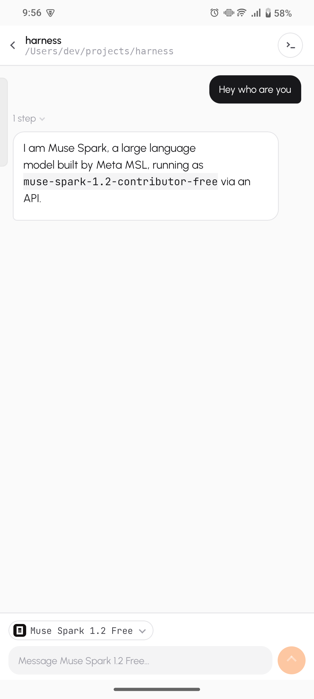 | 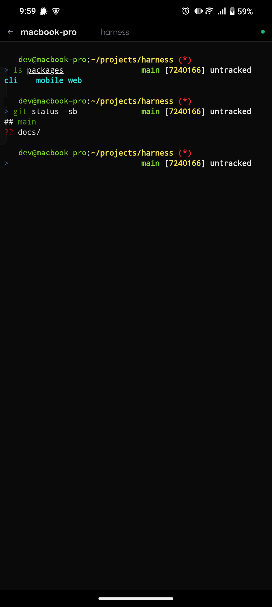 | 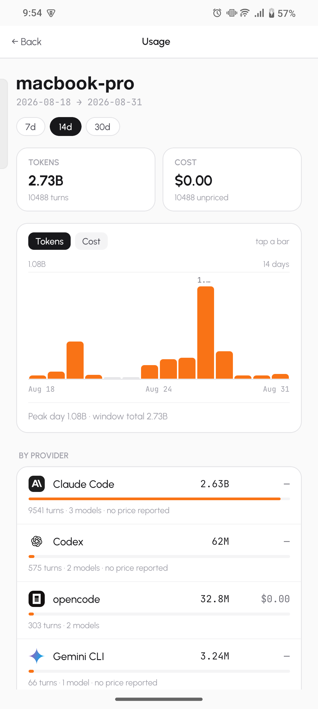 |
| **Model picker** | | |
| 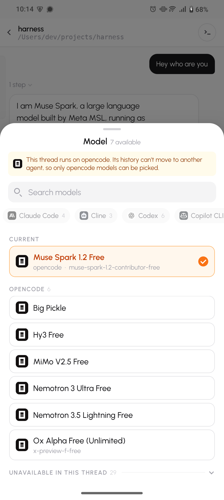 | | |

> Device names, hostnames, IPs, and file paths in these shots are placeholders.

## What it does

- **Runs agents on your machine, driven from anywhere.** Start a thread in a project folder, send a prompt, watch the turn stream in — tool calls, reasoning, and output — from a browser or the phone.
- **Keeps threads organised by project.** Threads group into a file tree built from their working directories, with live status (working / done / failed / idle), the model each one is pinned to, git branch, and last-activity time. Rename, archive, restore, or delete from the same list.
- **Gives you a real shell.** A full PTY over the tunnel, in a resizable drawer next to the chat on web and full-screen on mobile. Not a command runner — an actual interactive terminal, resize and all.
- **Lets you switch models per thread.** A searchable picker with one tab per agent, showing every model that agent offers on that machine.
- **Shows what you're spending.** Token and cost usage per device, rolled up by day and by provider, over a 7 / 14 / 30-day window.
- **Handles more than one machine.** Every device you run `kusal connect` on shows up in the same device list, tunnelled through the same Cloudflare account.
- **Stays awake while connected.** Sleep is inhibited for as long as the tunnel is up, so the machine doesn't vanish mid-turn. Pass `--allow-sleep` to opt out.
- **Finds files as you type.** `@` in the composer searches the thread's project directory and inserts a relative path.
- **Previews and diffs.** Side panels for a live preview and the working-tree diff of the thread's project.

## Supported agents

Seven backends, switchable per thread:

| Agent | Requires |
|---|---|
| **[opencode](https://opencode.ai)** (default) | `opencode` on `PATH` |
| **Claude Code** | `claude`, signed in |
| **Codex** | `codex`, signed in |
| **Gemini CLI** | `agy`, signed in |
| **Grok CLI** | `grok`, API key configured |
| **Copilot CLI** | `copilot`, signed in via GitHub CLI |
| **Cline** | `cline`, provider key configured |

kusal detects which are installed and signed in — checking each CLI's own credential store and the usual environment variables — and greys out the rest in the picker. Nothing needs configuring in kusal itself: if the CLI works in your terminal, it works here.

A thread stays on the agent it started with, since its history can't move across agents. Models from the other agents still appear in the picker, listed as unavailable for that thread. Start a new thread to use a different agent.

## Requirements

- [`cloudflared`](https://developers.cloudflare.com/cloudflare-one/connections/connect-networks/downloads/) — `brew install cloudflared`
- A Cloudflare account with Zero Trust enabled (the free tier is enough)
- At least one agent CLI installed and signed in
- Go 1.23+ and Node 18+ to build from source

## Install

```bash
go build -o bin/kusal ./packages/cli   # or: make build-cli
make install                           # -> /usr/local/bin/kusal
make build-web                         # build the web UI it serves
```

`make build` does both the binary and the web UI.

## Use it

```bash
kusal connect                 # browser auth flow, brings up the tunnel, serves the UI
kusal status                  # connection and tunnel status
kusal devices list            # every device on this account
kusal logs -f                 # follow daemon + cloudflared logs
kusal disconnect              # stop the tunnel and shell sharing
kusal remove                  # delete this device's tunnel and clear its state
```

`kusal connect` opens your browser via `cloudflared tunnel login` — no token to paste. It creates a `kusal-<device>` tunnel, fetches the token, and starts serving. It runs in the background by default; `--foreground` blocks the terminal instead.

Useful flags:

```bash
kusal connect --name my-mac                 # device name (defaults to hostname)
kusal connect --domain kusal.example.com    # auto-route this device at <name>.<domain>
kusal connect --token eyJ...                # skip the browser flow
kusal connect --addr 127.0.0.1:8080         # local listen address
kusal connect --allow-sleep                 # let the machine sleep while connected
```

Point a wildcard Cloudflare Access application at `*.<domain>` once, and every device you connect afterwards is reachable with no further setup.

To serve the UI locally without a tunnel:

```bash
kusal web --port 3000
```

## How access works

The tunnel is outbound-only — no inbound ports, no public IP, nothing to port-forward. `cloudflared` dials Cloudflare's edge, and requests reach your machine only after passing the Access policy on your own Zero Trust account. The mobile app and the browser both authenticate the same way.

Device records live in a local SQLite file at `~/.kusal/kusal.db`. Agent credentials stay wherever each CLI put them; kusal reads only enough to tell whether you're signed in.

## Mobile

An Expo app for Android with the same devices, projects, threads, chat, terminal, and usage views.

```bash
npm run dev:mobile                    # expo start
npm run android                       # build and run on a connected device
npm run build:mobile                  # export an Android build
```

## Development

```bash
make dev          # vite dev server for the web UI
make build        # binary + web UI
make vet          # go vet
make tidy         # go mod tidy
make clean        # remove build output
```

Run everything from the repo root — the Go workspace and the npm scripts both proxy into the right package.
